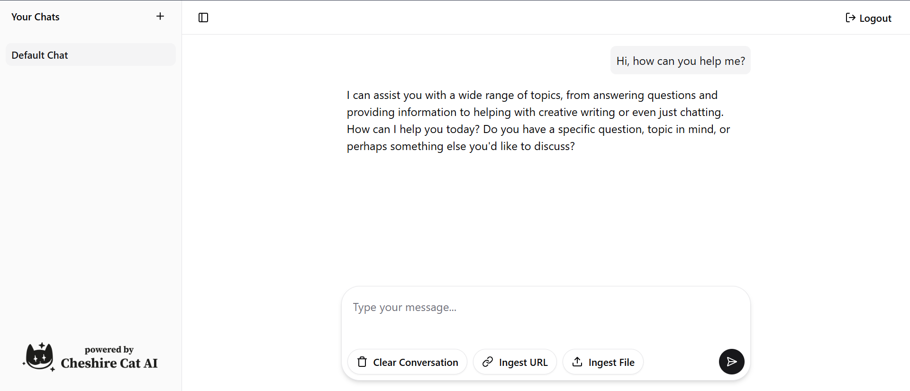

# Cheshire Chat

> Note: This project is currently in early development and is not yet ready for production use. Features are still being implemented and bugs are expected.

Cheshire Chat is a modern web interface for Cheshire Cat AI, providing an intuitive and feature-rich chat experience.

## Features

- 💬 Real-time chat with streaming responses
- 📄 Context ingestion via file uploads and URLs
- 📱 Responsive design that works on desktop and mobile
- 🎨 Modern UI with a clean aesthetic

## Technology Stack

This project uses modern web technologies:

- React 19
- Tailwind CSS v4 for styling
- shadcn/ui for UI components
- Tanstack Start
  - TanStack Router for routing
  - Vinxi for server-side and client-side capabilities
- TipTap for rich text editing

## Getting Started

### Prerequisites

- Node.js (v18 or later)
- pnpm (v10 or later)
- A running Cheshire Cat AI instance (https://cheshirecat.ai/)

## Development Status

This project is under active development. Current progress:

- ✅ Basic authentication flow
- ✅ Chat interface with streaming responses
- ✅ File and URL ingestion
- ✅ Error handling and user feedback
- 🚧 Multi-chat support (in progress)
- 🚧 Markdown formatting (planned)
- 🚧 Settings and customization (planned)
- 🚧 Testing (planned)
- 🚧 Documentation (planned)

## Acknowledgments

- [Cheshire Cat AI](https://github.com/cheshire-cat-ai) for being a great AI framework with a great community
- [Tanstack Start](https://tanstack.com/start/latest) for being a great full-stack React framework
- [shadcn/ui](https://ui.shadcn.com/) for being a great component library and the inspiration for UI development
- [TipTap](https://tiptap.dev/) for being a great rich text editor with a lot of out-of-the-box features
- All the amazing open-source libraries that make this repo possible
